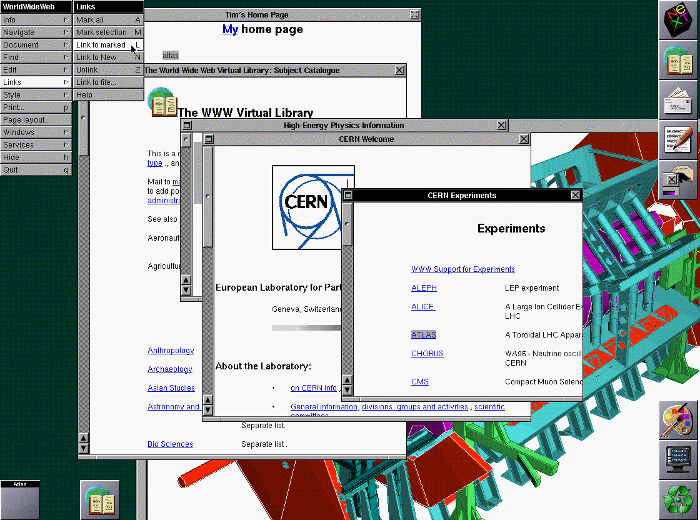

## 前 Web 时代

### 前言

互联网/因特网（Internet），是指众多计算机网络互联而成的，能提供数据传输与应用服务的网络基础设施。而浏览器（browser）和万维网（World Wide Web，简称 Web）就是建立在 Internet 的基础上的。本质上，浏览器是用于访问 Web 的客户端软件，而 Web 是运行在互联网之上的应用。Internet 的诞生，提供了 Web 所需的先决条件。

### Internet 的诞生

我们都知道互联网（Internet）起源于1969年美国的阿帕网（ARPANET），它是美国国防部高级研究计划局（ARPA）与苏联在科学技术上发生“实验室冷战”的结果。美国国防部认为，如果仅有一个集中的军事指挥中心，万一这个中心被原苏联的核武器摧毁，全国的军事指挥将处于瘫痪状态，其后果不堪设想。因此有必要设计这样一个分散的指挥系统——它由一个个分散的指挥点组成，当部分指挥点被摧毁后其它点仍能正常工作，而这些分散的点又能通过某种形式的通讯网取得联系。

1969年，在美国西南部的四所大学的四台大型计算机通过 ARPANET 连接了起来。11月，操作员 Charley Kline 在加州大学洛杉矶分校的主机上，尝试向60公里外斯坦福研究所的主机发送「login」指令，但是系统在刚刚打出「l」和「o」两个字母后就宕机了，所以「lo」就成了第一条由互联网传输的信息。

随着 ARPANET 的非军事用户越来越多，ARPANET 将其中的45个节点分离出去，形成了 NSFNET。后来，NSFNET 所覆盖的范围逐渐扩大到全美的大学和科研机构。可以说 NSFNET 和 ARPANET 就是美国乃至世界 Internet 的基础。

### 有了 Internet，为什么还要 Web？

早期的 Internet 虽然使得计算机可以相互连接了，但是主要运用于学术和军事用途，早期的服务主要是电子邮件（Email）、文件传输（FTP）等。

> 1971年，Ray Tomlinson 通过网络发送了第一封电子邮件，并选择采用“@”连接用户名及邮箱所属计算机的名称。传说第一封电子邮件的内容是键盘的第一排字母：“QWERTYUIOP”。

虽然 Internet 做到了基础的互通互联，但是直到20世纪80年代晚期互联网才真正成为全球性的通讯平台。在这样的平台上，人们可以自由地发布、链接、浏览信息才会成为一种可能和必需。在这之前，Email、FTP、Usenet 都不需要信息的网状结构，因为它们总是面向一个较小的群体。当互联网变成一个全球性的存在，需要任何人都可以看任何人的信息，需要任何人都可以自由地组织其能看到的信息，上面的应用就都不合适了。于是 Web 诞生了。

Web的核心是三个协议：

*   统一资源标识符（Uniform Resource Identifier, URI），解决文档命名和寻址
*   超文本传输协议（Hypertext Transfer Protocol, HTTP），解决文档的快速传输
*   超文本标记语言（Hypertext Markup Language, HTML），解决超文本文档的表示

与其说 Web 是一种技术，倒不如说它是对信息的存储和获取进行组织的一种思维方式。按照 Tim 的看法，这三个协议的重要性依次递减。这可能不符合日常 Web 用户的认识，因为 HTML、HTTP 是对用户可见的，而 URI 的重要性却不易察觉。但恰恰是 URI 的设计核心体现了 Tim 的设计指导哲学，即尽可能允许人们自由行事，自由地发布文档和互联文档。这可能是Web成功的最核心的原因。

### 浏览器的“前置技能”

任何颠覆性技术的诞生，都根植于技术生态的长期积累，浏览器也不例外。浏览器作为人机交互范式的革命性产物，其出现依赖于以下五大技术与概念的成熟：

*   超文本（1963）：美国社会学家 Ted Nelson 首次提出“超文本”（Hypertext）的概念。hyper 在古希腊语中意为“超”、“上”、“外”、“旁”等，超文本指的是，大量的书写材料或图像材料，以复杂的方式相互联系。
*   图形用户界面（GUI，1973）：美国加州的 Xerox PARC 研究出了世界上最早使用图形用户界面 Xerox Alto。
*   TCP/IP（1974）：Vint Cerf 和 Bob Kahn在IEEE期刊上发表的关于分组交换网络通信的论文，奠定了 TCP/IP 协议的理论基础，形成未来的互联网分层架构。
*   域名系统（DNS, 1983）：由 Paul Mockapetris 设计，将域名和IP地址相互映射（ example.com 和 93.184.216.34），让网站可以被记忆。
*   标记语言（SGML 1986）：SGML 是国际标准化组织（ISO）发布的元语言，定义了早期的网页结构化文档标准，是 HTML 的先驱（正如 HTML 又是 XML 的先驱）。

### Web 和世界上第一个浏览器

第一个浏览器是由英国的计算机科学家蒂姆·伯纳斯-李（Tim Berners-Lee）创造的。1989年，Tim Berners-Lee 在欧洲核子研究组织（CERN）期间，构想建立一个以超文本系统为基础的项目，为全世界的科学家提供一个自动化的、分享与更新信息的共享平台。于是第一次提出了万维网（World Wide Web）的概念。

1990年，Tim Berners-Lee 开发了第一个浏览器 “WorldWideWeb”（后来为避免与万维网重名更名 Nexus），第一个万维网服务器“httpd”，和第一个网站 [info.cern.ch](https://link.zhihu.com/?target=http%3A//info.cern.ch/) 。

他同时基于底层协议（TCP/IP）和早期网络协议（FTP、SMTP）创造了超文本传输协议（HTTP），根据超文本系统（NLS、HyperCard）和标记语言（GML、SGML）设计了超文本标记语言（HTML），根据文件系统的路径结构、域名系统（DNS）等设计了统一资源定位符（URL）。这些构成了如今 Web 与 浏览器必不可少的组成部分。

> “万维网需要的技术，例如超文本系统、互联网和多种字体的文本对象等等，大部分都已经设计出来了。我需要做的只是把它们结合在一起。这是一个广义化步骤，要进入更高的抽象层次，把现有的文件系统想象为一个更大的虚拟文件系统的一部分。”
>
> 
——Tim Berners-Lee

## Web 时代

### 浏览器传播与浏览器大战

但是早期的浏览器功能单一，仅支持文本和超链接，而且依赖命令行操作，限制了普通用户接受浏览器。

1993年，伊利诺伊大学 NCSA（美国国家超算中心）的工作人员，开发的 Mosaic 浏览器，成为了第一个支持图片和图形界面的浏览器，在当时人气爆发地大受欢迎。

但是这时的互联网服务大头依然是大学和科研机构，想要浏览器进一步传播，还需要商业资本的入场。

1994年，原 Mosaic 团队成员创立网景（Netscape）公司，在 Mosaic 浏览器的基础上，发布 Netscape Navigator。Netscape 浏览器占据80%的市场份额。

微软（Microsoft）也关注到了浏览器的潜力，于是于1995年推出 IE 浏览器，就此与网景公司展开了历史上著名的浏览器大战。从 IE3 开始，微软将浏览器和操作系统捆绑在一起提供给用户，在微软的强大攻势下，IE 的市场占有率一度达到95%。

2003年，苹果发布基于 WebKit 内核的 Safari 浏览器。

2004年，Mozilla 发布 Firefox 浏览器，还在2005年创建了开源文档 MDN。\
2008年，谷歌加入了浏览器战争，发布了自己的浏览器 Chrome，还为 Chrome 开发了自己的 JavaScript 引擎 V8。Chrome 的优点是界面简洁、加载快速、数据安全，已经渐渐成为了使用最多的浏览器。

### 浏览器的遗产：你今天的生活如何被它改变？

浏览器成为终身学习的核心工具，大大促进了教育与知识获取的民主化。通过在线课程平台和知识社区，用户可随时获取专业内容。正如此时此刻你正在阅读这篇文章，大概率也是通过浏览器进行的，我个人专业以及非专业知识的学习，也极大部分地借助了浏览器。如果没有浏览器，当今社会的知识无疑会更加封闭与垄断，也会失去许多色彩。

***

参考文献：

*   <https://www.cnblogs.com/xusheng/articles/2420494.html>
*   <https://en.wikipedia.org/wiki/Tim_Berners-Lee>
*   <https://www.icann.org/zh/blogs/details/the-first-message-transmission-29-10-2019-zh>
*   <https://www.mozilla.org/zh-CN/firefox/browsers/browser-history/>
*   <https://zhuanlan.zhihu.com/p/425675883>
*   <https://developer.mozilla.org/zh-CN/docs/Web/URI>
*   <https://www.w3.org/Protocols/WhyHTTP.html>
