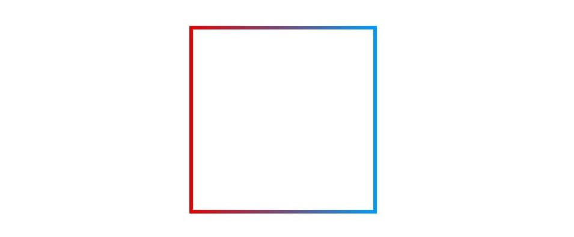
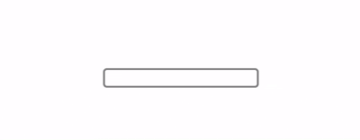
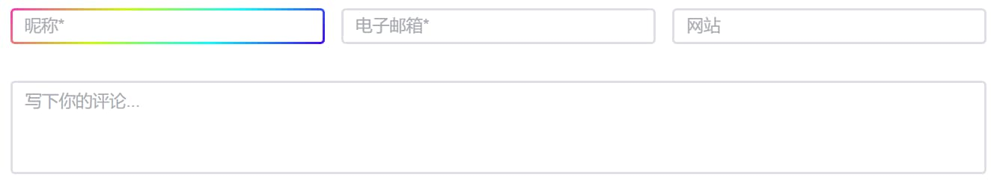

# 盒子边框

今天做评论功能的时候，我觉得普通的输入框不太好看，于是想着让输入框变个色，所以做了这么一个玩意儿。但是在文章的最开始，作为引入，先不讲输入框的颜色渐变怎么实现，先说说更为简单的——盒子 border 的渐变色如何实现。

## 1. 如果不需要圆角效果

那么通过给盒子加上**边框属性** `border-image-source` 和 `border-image-slice`实现渐变色

*   `border-image-source` 指定了边框的背景图片；
*   `border-image-slice: 1` 表示背景图片每边向内裁剪 1%，作为边框；

缺点是不能给盒子添加圆角效果。

```css
.box { 
    ...
    border: 4px solid;
    border-image-source: linear-gradient(to right, #E80000, #0099FF);
    border-image-slice: 1; 
}
```



## 2. 如果需要圆角

如果需要圆角效果，可以增加一层盒子，利用 `background-image`、`background-clip`、`background-origin` 这三个**背景属性**实现

*   `background-image` 设置元素的背景图片；
*   `background-clip` 设置元素的背景（背景图片或颜色）是否延伸到边框、内边距盒子、内容盒子下面；
*   `background-origin` 规定了背景图片的起始定位区域；

实现的逻辑是，linear-gradient 绘制的两个背景层，其中白色的被绘制在上方，边框透明；渐变的背景被压在下方，上方是 padding-box，下方是 border-box，所以在上方的白色背景**不会延伸**出去，而透明边框位置就可以让下层的渐变颜色显示出来。

**HTML**

```html
<div class="border-box">
    <div class="content"></div>
</div>
```

**CSS**

```css
.border-box {
    ...
    border: 4px solid transparent;
    border-radius: 16px;
    background-clip: padding-box, border-box;
    background-origin: padding-box, border-box;
    background-image: 
        linear-gradient(to right, #fff, #fff),
        linear-gradient(to right, #33CDD0, #EEF111); 
    }
.content {
    ...
}
```


# input 边框

那么我们又是如何在输入框 *input* 里实现边框的颜色渐变的呢？

很简单，只要让**边框透明**，设置 border 的 color 为 ` transparent`；还要加上 `outline: none` 这个属性，可以让原本聚焦时的轮廓消失（border 和 outline 的主要区别在于，outline **不占据空间**）。其余部分就和上一个的实现方法一样了。

```css
<input class="gradient"></input>
.gradient {
    outline: none;
    border: 2px solid transparent;
    background-clip: padding-box, border-box;
    background-origin: padding-box, border-box;
    background-image:
      linear-gradient(90deg, #fff, #fff),
      linear-gradient(90deg, #AB804E, #F3E499, #AB804E);
}
```


如果我们要让聚焦时 **聚焦时** 框的渐变色，就这样实现：

```css
/* html */
<input class="gradient"></input>

/* css */
.gradient {
  ...
  outline: none;
  border: 2px solid grey;
  background-clip: padding-box;
}
.gradient:focus {
  border: 2px solid transparent;
  background-clip: padding-box, border-box;
  background-origin: padding-box, border-box;
  background-image: 
    linear-gradient(white, white),
    linear-gradient(135deg, #ff33b4, #c8ff00, #00ffff, #4400ff);
}
```




**最终选中输入框效果**：




# 总结

实现边框渐变主要是靠 `background-image`、`background-clip`、`background-origin` 这三个属性实现，如果是输入框，那么还需要让 border 为 `transparent`，outline 为 `none`。
