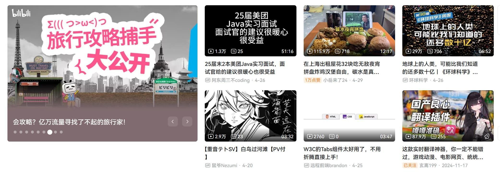
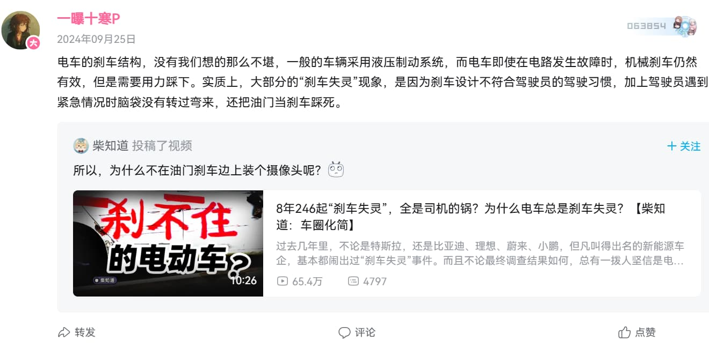
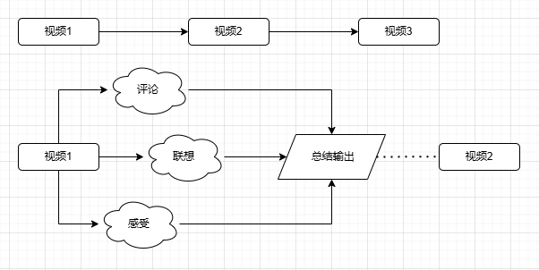
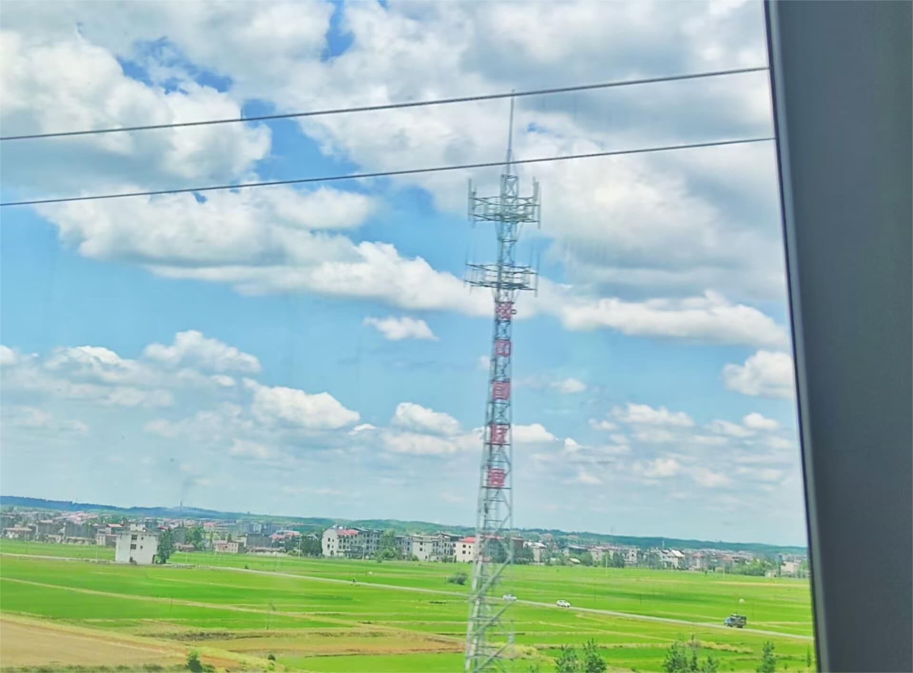

# 收藏夹里的平行宇宙
我的收藏夹里躺着**269个**“稍后再看”，就像便利店里永远卖不出去的临期便当。

每天在教室和食堂两点一线的间隙，都是我在网络的世界里乐此不疲的时刻。构成我网络生活的，大概7分是b站，3分是抖音。我打开b站首页，就好比选妃一般热闹，那些夺人眼球的视频标题，封面上还要再用**加大加粗、再高亮**的文字来武装，我的注意力总是被劫持了。而我对它们的最高赞赏，就是加入稍后再看和收藏夹，然后彻底忘掉。

封面设计劫持了注意力

上周试着点开半年前收藏的《生命进化史》解说，进度条才爬到三分之一，手指已经条件反射地划走到下一个视频去了。这场景让我想起每次放假我带着专业书和小说回家，最后却在b站消磨一整天。我们这代人对待知识，就像在快餐店柜台前踮脚张望的小孩，明明饿得慌，却对眼前五光十色的菜单**挑花了眼**。

# 注意力也想逃离沉闷
要知道世事多变人生无常，我们不可能像古时士人一样——把绑竹简的皮绳读断好多次、不厌其烦地把书本翻几十上百遍，在当今社会生活的我，番剧看过一遍书读过一遍之后，就**不想再碰了**。这便是我的逃脱方法，逃脱烦闷、逃脱不如意，尝试新的东西又有什么错误可言呢？

# 注意力的乐观主义
但是有时候我就想好好读一本书，看一部剧，让紧绷的思维与神经放放松。我想起那一天，我刷完一个视频，并不急着立刻跳到下一个毫不相关的视频，而是看完视频认真地**发表评论**。现在我才反应过来，这就是最好的方法——认真的思考总结后，在任何地方输出自己的观点。

发表评论

就像毛泽东的读书方法，读书时从这个文本可以引用到其他作品、别人的话，来解释当下的内容。让思绪活泼跳跃，又不至于混乱散漫。

曾经我把每一个收藏的视频都看得那么重要，但是又逐渐连点开的欲望都丧失了。现在我知道收藏什么不重要，重要的是我会在看完一个视频后留下一条**小小的评论**，即使微不足道也好。这些看似不经意与不那么重要的思维碎片，反而成了记忆最牢固的部分。

# 视觉空间学习

学习的过程中，大脑从外界获取信息，而其中绝大部分都是通过视觉获取的，所以想要加深记忆，可以从**增强视觉感受**入手。于我个人而言，图形和影像的的记忆最深刻。以后再回顾的时候，不是去看长篇大论的文字——而是通过图片作为第一层回忆的介质，在一瞬间就能回忆起来。

可能我是**视觉空间学习者**，盯着大段的文字公式心里就会产生“这是啥”的疑问，但是一旦我看到图片，清晰的认识就很容易建立了。而往往视觉空间者被误认为“注意力不集中”，这是因为当代教育系统更适合语言逻辑型学习者，他们更擅长记忆与背诵大段的文字逻辑，而不像我一样，非常依赖三维的视觉空间记忆，即使是前天在看川端康成的《雪国》时，我也要把每一段文字转化成对应的场景，才能非常理解。

# 千帆历尽
最终我们历尽千帆，回到了现实中的生活。我的收藏夹依然定期膨胀，但是在看纪录片时会顺手记下能感兴趣的冷知识。偶尔还是会掉进直播间的兔子洞，不过口袋里总揣着块现实世界的怀表。当思维变成了自己的知识和经验，其就可以称为长久的记忆，成为了所谓“留下来”的东西。在这个万物皆可收藏的时代，或许真正的长期主义，是把每个当下都活成不可复制的瞬间。

五一返校
